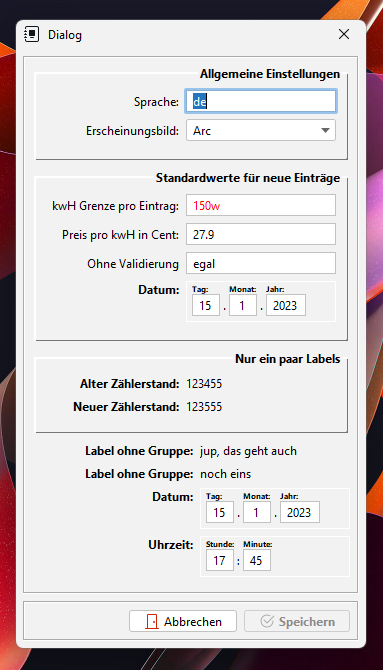

# FormDialog

**FormDialog** ist eine Java Bibliothek, mit der ich in einer Swing-Anwendung ohne viel Aufwand ein Formular
erstelle. Die Validierung der Werte in den Textfeldern wird unterstützt.
Diese Bibliothek wurde mit Java 17 getestet.

## Screenshots



## Installation

**Das muss in die pom.xml:**

```xml
<dependency>
    <groupId>de.schipplock.gui.swing.dialogs</groupId>
    <artifactId>formdialog</artifactId>
    <version>0.0.4</version>
</dependency>
```

## Wie verwende ich diese Bibliothek?

**Es wird folgender Import benötigt:**

```java
import de.schipplock.gui.swing.dialogs.FormDialog;
```

**Einen FormDialog erzeugen:**

```java
new FormDialog(this, true)
        .title("Dialog")
        .confirmButton("Speichern")
        .cancelButton("Abbrechen")
        .beginGroup("Allgemeine Einstellungen")
            .textfield("LANGUAGE", "Sprache:", "de", "tooltip", 150, (value) -> {
                 return true;
             })
             .combobox("THEME", "Erscheinungsbild:", 150, "dark", LAFManager.create().getInstalledLookAndFeelNames())
        .endGroup()
        .beginGroup("Standardwerte für neue Einträge")
            .textfield("LIMIT", "kwH Grenze pro Eintrag:", "150w", "tooltip", 150, (value) -> {
                try {
                    return Integer.parseInt(value) >= 0;
                } catch (NumberFormatException ex) {
                    return false;
                }
            })
            .textfield("PRICE", "Preis pro kwH in Cent:", "27.9", "tooltip", 150, (value) -> {
                try {
                    return Double.parseDouble(value) >= 0;
                } catch (NumberFormatException ex) {
                    return false;
                }
            })
            .textfield("NOVERIFY", "Ohne Validierung", "egal", "tooltip", 150)
        .endGroup()
        .beginGroup("Nur ein paar Labels")
            .label("LABEL1", "<html><b>Alter Zählerstand:</b></html>", "123455", "tooltip", 150)
            .label("LABEL2", "<html><b>Neuer Zählerstand:</b></html>", "123555", "tooltip", 150)
        .endGroup()
        .label("LABEL3", "<html><b>Label ohne Gruppe:</b></html>", "jup, das geht auch", "tooltip", 150)
        .label("LABEL4", "<html><b>Label ohne Gruppe:</b></html>", "noch eins", "tooltip", 150)
        .onConfirm((values) -> {
            values.forEach((componentName, value) -> {
                System.out.printf("component %s has value %s%n", componentName, value);
            });
        })
        .autosize()
        .center()
        .setVisible(true);
```

Diese Zeilen erzeugen einen Dialog, wie er etwas weiter oben in diesem Dokument als Screenshot gezeigt wird.
Ein voll funktionierendes Demo habe ich im Testordner abgelegt (`FormDialogDemo`).

## License
[Apache License 2.0](https://choosealicense.com/licenses/apache-2.0/)